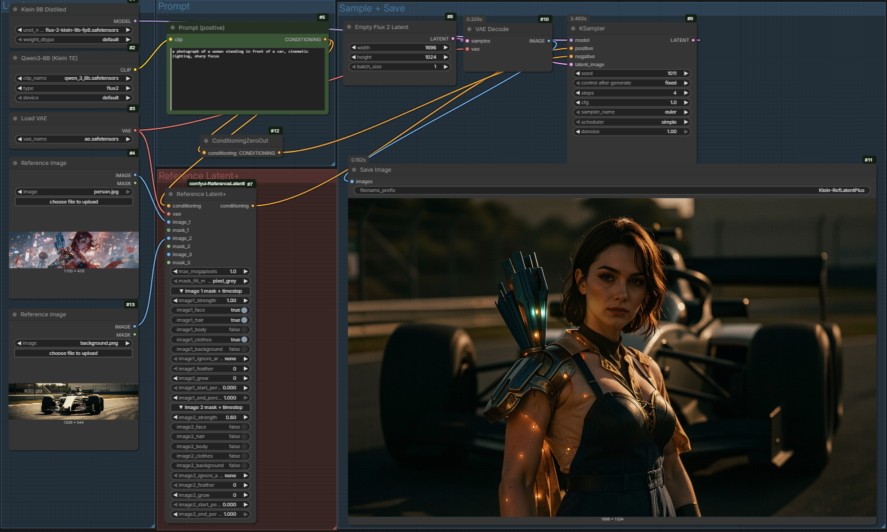

<h1 align="center">Reference Latent+ for ComfyUI</h1>

<p align="center">
  A drop-in replacement for ComfyUI's stock <code>ReferenceLatent</code> node, with the controls I always wished it had.<br>
  Per-image strength, per-image timestep gating, per-image MediaPipe auto-masks, megapixel cap on attention cost, and 1–4 image inputs in a single node.
</p>

<p align="center">
  <strong>Works with Flux, Flux2/Klein, Lumina2, Z-Image, Wan, Hunyuan, Qwen-Image</strong> — anything that consumes <code>reference_latents</code>.
</p>

<p align="center">
  <a href="https://buymeacoffee.com/lorasandlenses"></a>
</p>

<p align="center">
  
</p>

---

### Why I built this

The stock `ReferenceLatent` is a tiny wrapper — it just attaches a latent to the conditioning's `reference_latents` key and walks away. That's fine for the obvious case (drop in a ref, get an output), but the moment I tried to push it I hit walls:

- No way to dial strength up or down — it's binary on/off.
- No timestep gating — the ref is active for the whole denoising schedule whether I want it or not.
- The ref's *whole image* leaks into output: pose, framing, background, even crop. There's no "use the face only, ignore the rest" knob.
- Multi-ref means wiring multiple `LoadImage → VAE Encode → ReferenceLatent` chains by hand.
- Bigger refs = quadratic attention cost, with no easy way to cap it.

I built **Reference Latent+** as the node I wished existed. Each image gets its own strength, its own timestep range, and its own auto-mask config. Slots reveal progressively as you connect them. MediaPipe-driven masks for face / body / clothes / background are built in. There's a global cap on ref size to keep attention compute under control.

I tested all of this against Flux2/Klein 9B (the model I'm building [Fizgig](https://github.com/shootthesound/Fizgig) for), but the underlying mechanism is generic — it works on every model in ComfyUI that consumes `reference_latents`.

---

### What's new vs stock ReferenceLatent

- **Per-image signed strength** (`-5.0 … 50.0`, default `0.85`). 1.0 = stock strength. 0 = bypass that image entirely. <0 = experimental "anti-reference" — model pulled away from this ref's features.
- **Per-image timestep range.** Restrict any ref to a specific portion of the denoising schedule. Different refs can have different ranges; the node partitions the schedule so each timestep has exactly one set of active refs (no double-counting via overlapping conditioning).
- **Per-image compositional masks** with MediaPipe auto-detection. Tick `face` / `hair` / `body` / `clothes` / `background` to isolate just that part of the ref before encoding. Or wire your own MASK and it overrides.
- **Three mask-fill modes** — `pixel_grey` (in-distribution soft neutral), `latent_zero` (cleanest "ignore these tokens"), `latent_noise` (randomised attention shape). All three are novel; no existing ComfyUI node masks reference latents.
- **Megapixel cap** with aspect-preserving downscale. Default 1 MP — keeps attention compute proportional to a 1024² generation regardless of how big your source image is. Never upscales.
- **1–4 image inputs in one node.** No manual VAE Encode wiring. Slots reveal progressively as previous ones get connected; collapsible per-image config groups appear only for connected images.
- **VAE input on the node** — handles VAE encode internally so I don't have to chain it.

---

### Quick start

1. Drop the `comfyui-ReferenceLatentPlus` folder into `ComfyUI/custom_nodes/`.
2. (Optional, for the auto-mask feature) `pip install mediapipe` into your ComfyUI venv. The selfie_multiclass model auto-downloads on first use.
3. Restart ComfyUI. The node appears under **`advanced/conditioning > Reference Latent+`**.

There's a ready-made example workflow in [`examples/klein-9b-reference-latent-plus.json`](examples/klein-9b-reference-latent-plus.json) — drag it into ComfyUI to see the wiring (Flux2/Klein 9B Distilled, 4-step). Adjust the model filenames in the loaders to match what you have installed.

Wire it up:

```
LoadImage  ───► image_1     ┐
VAE        ───► vae         │
Prompt CLIP ──► conditioning ├──► Reference Latent+ ───► KSampler [positive]
                            │
(optional) LoadMask ──► mask_1
```

That's it. As you connect `image_1`, an `image_2` slot appears. Connect that and `image_3` shows up. And so on.

---

### Inputs at a glance

#### Required
- `conditioning` (CONDITIONING) — your prompt's CONDITIONING.
- `vae` (VAE) — for encoding the input images.
- `image_1` (IMAGE) — first reference (always required).
- `max_megapixels` (FLOAT, 0.1–4.0, default 1.0). Caps each ref by area. Aspect ratio preserved, never upscales. Lower = faster.
- `mask_fill_mode` (DROPDOWN). How masked-out regions are neutralised:
  - `pixel_grey` (default) — replace with mid-grey before VAE encode. In-distribution.
  - `latent_zero` — encode full image, zero the latent at masked positions. Cleanest "ignore" but off-distribution.
  - `latent_noise` — encode full image, fill masked latent positions with deterministic Gaussian noise.

#### Optional reference inputs (progressive disclosure)
- `image_2` / `image_3` / `image_4` — additional refs. Slots reveal as you connect the previous one.
- `mask_1` / `mask_2` / `mask_3` / `mask_4` — explicit per-image masks. Override the auto-mask config if wired.

#### Per-image collapsible groups (one per connected image)
- `strength` (-5.0 to 50.0, default 0.85) — signed scaling of this image's ref latent.
- `face` / `hair` / `body` / `clothes` / `background` — MediaPipe-driven auto-mask regions.
- `ignore_area` (none / left / right / top / bottom) — exclude a side strip from the auto-mask.
- `feather` (0–200 px) — soften mask edges.
- `grow` (-200 to 200 px) — grow (>0) or shrink (<0) the mask area.
- `start_percent` / `end_percent` (0.0–1.0) — per-image timestep range. ComfyUI's percent: `0.0` = start of denoising (noisy), `1.0` = end (clean).

---

### Mask precedence

For each image:

1. If `mask_N` is wired → use it, ignore that image's auto-mask config.
2. Else if any region boolean is ticked → run MediaPipe, generate mask.
3. Else → no mask, image used as-is (= what stock ReferenceLatent would do).

---

### Empirical notes (Flux2/Klein 9B)

I built this against Klein and tested most of the defaults there:

- **`strength = 0.85`** felt like the sweet spot for typical prompts. 1.0 was slightly too dominant; <0.5 too subtle.
- **For style/identity, gate the ref to the late timesteps** — try `start_percent=0.6, end_percent=1.0`. Klein's clean-end timesteps carry style/identity signal; the noisy-early timesteps drive composition. Restricting refs to the clean end lets your prompt's composition come through unconstrained.

On other models the mechanism still works but the sweet-spot values may differ — try `strength=1.0` first, then dial.

---

### Compatibility

The node attaches `reference_latents` to the conditioning dict. Models that read this key (and therefore work with this node):

- **Flux family** — Flux1, Flux2/Klein, LongCatImage
- **Lumina2** / **Z-Image**
- **Wan family** — Wan21, Wan22, Wan21_HuMo, Wan22_Animate
- **Hunyuan**
- **Qwen-Image**

The optional `reference_latents_method` key is read by Flux-family models only. Others ignore it harmlessly.

---

### Limitations / known gotchas

- **MediaPipe is optional.** If you don't have it installed, the auto-mask feature is silently a no-op — ticking a region does nothing. Explicit `mask_N` wiring still works.
- **`latent_noise` and `latent_zero` are off-distribution.** No model was trained with masked-out reference latents; behaviour at high mask coverage is exploratory. `pixel_grey` stays in-distribution and is the safe default.
- **Negative strength is experimental.** Models weren't trained on negative refs; results vary. Useful for "generate something that does NOT look like this" but unpredictable.
- **The masking-of-ref-latents idea is novel.** No other ComfyUI node does it (I checked). That means there's no community-validated baseline for what works — test on your own use cases.

---

### Support the project

If this node saves you wiring time or unlocks something you couldn't do with the stock node, consider supporting development:

<a href="https://buymeacoffee.com/lorasandlenses"></a>

I also build [**Fizgig**](https://github.com/shootthesound/Fizgig) — a focused trainer, profiler, repair workbench and explorer for Flux 2 Klein 9B LoRAs. If you train LoRAs on Klein, take a look.
